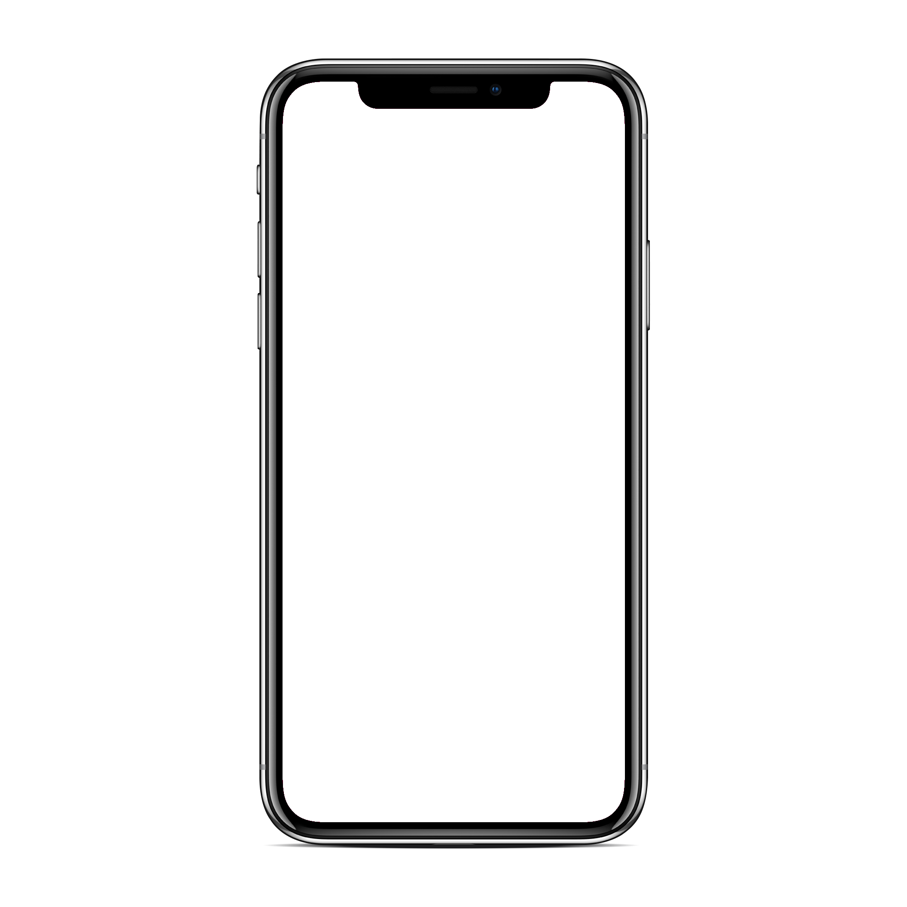

# Generatore di mockup iPhone



Questo progetto è un semplice generatore di mockup nella cornice di un iPhone 11 Pro che, di fatto, consente di "incorniciare" i propri screenshot in un dispositivo iOS per renderli più appetibili per la pubblicazione sui social network e sui blog.

È stato usato attivamente nello sviluppo di molti progetti in produzione, fra cui [Bookaround](https://bookaround.app). Basa il suo funzionamento sulla libreria open-source [PIL](https://en.wikipedia.org/wiki/Python_Imaging_Library).

## Installazione e utilizzo

Per utilizzare questo script è sufficiente clonare la repository ed inserire nella radice della repo gli screenshot da incorniciare. Questi devono essere file PNG e devono rispettare l'aspect ratio di un iPhone 11 Pro (sono, quindi, specialmente compatibili screenshot effettuati su dispositivi iOS successivi all'iPhone X).

Per avviare il processo di framing è sufficiente invocare lo script `main.py` con una versione di Python3:

```sh
python3 main.py
```

Una volta avviato lo script, verrà chiesto il nome del progetto e se eliminare i precedenti risultati.

### Installazione dei requisiti

Nel caso il progetto desse errori di import, occorrerà installare i pacchetti richiesti tramite il seguente comando:

```sh
pip install -r requirements.txt
```

## Contribuzioni

Il progetto è totalmente libero ed open-source, coperto da licenza GPLv3: qualsiasi tipo di contribuzione e miglioramento è ben accetta.